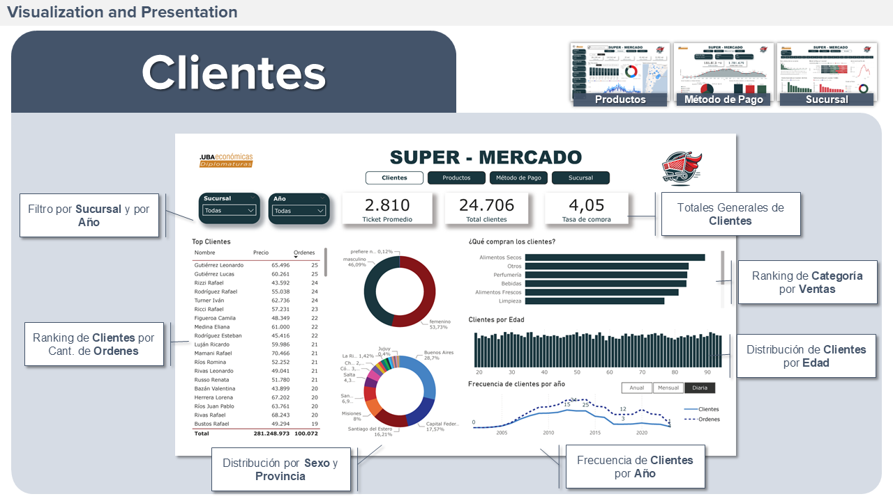
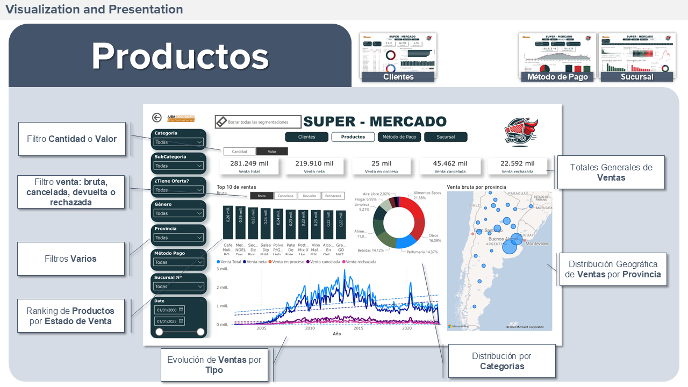
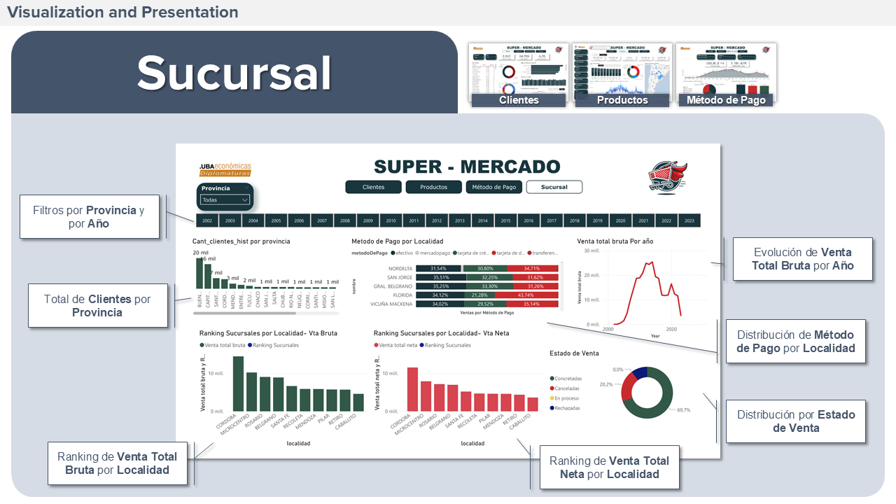

# analisis-supermercado-fceuba
This project applies data analysis to supermarket sales using Python (Pandas, Numpy, Sqlalchemy) and Power BI. It covers ETL tasks, data cleaning, and visualization, providing insights into best-selling products, customer segmentation, and purchasing patterns.

## 📂 Content  
- **📁 notebooks/** → Notebooks in Google Colab.  
- **📁 imagenes/** → Screenshots of the Power BI dashboard.  

## 🚀 How to use it  
1. Open the notebooks in Google Colab or download them from the repository: 
   - [🔗 View in Google Colab ETL](https://colab.research.google.com/drive/1RAiOQhy4D9O6HEWEqPbHBsC5IiLp6U2Q?usp=sharing) → Data extraction, analysis, and cleaning on OLTP base.  
   - [🔗 View in Google Colab TL](https://colab.research.google.com/drive/1qbrsthXiDJxyqNKBUaaW3u-rwM326PRj?usp=sharing) → Transformation and loading into OLAP.  
2. [🔗 View in Power BI Service](https://app.powerbi.com/view?r=eyJrIjoiZWE2ZjVlNmItMjcxNy00NzlmLTkxZDYtMTljZTYxNmFlNjI4IiwidCI6IjRjODE4Zjc5LWFiODQtNDU1Mi05YjdjLTJmZTcxNWIwZDBkNSIsImMiOjR9&pageName=ReportSection) or download the `Dashboard_supermercado.pbix` file and explore it in Power BI Desktop.

## 🛠 Technologies used  
- Python (Pandas, Numpy, Sqlalchemy)  
- Power BI  
- Google Colab  
- SQL

## 📸 Screenshots  
 

## 📈 Key results  
✔️ Identification of best-selling products  
✔️ Customer segmentation based on purchases  
✔️ Sales trends analysis  
